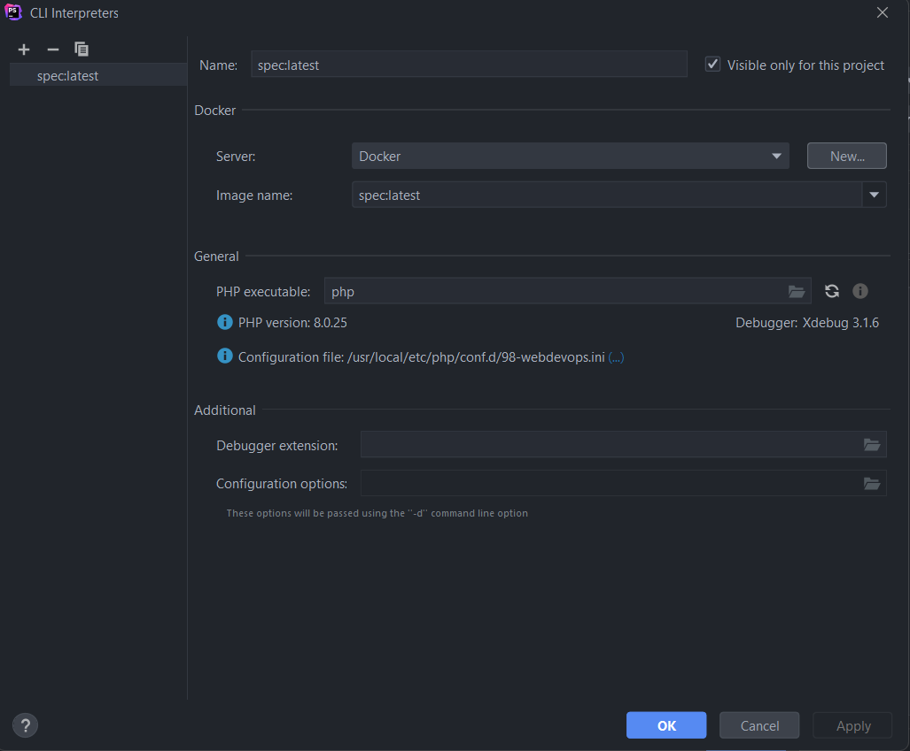
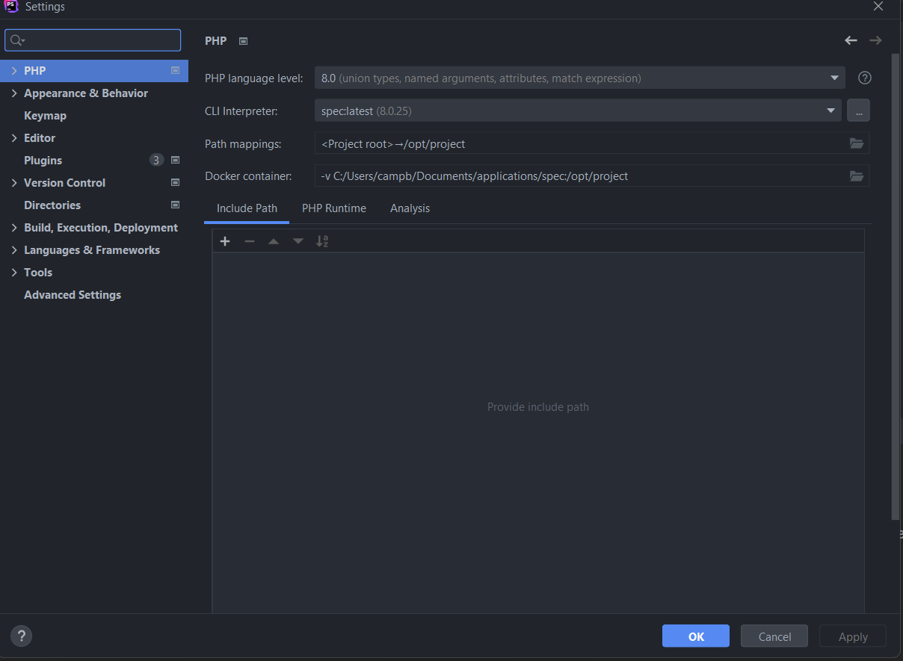
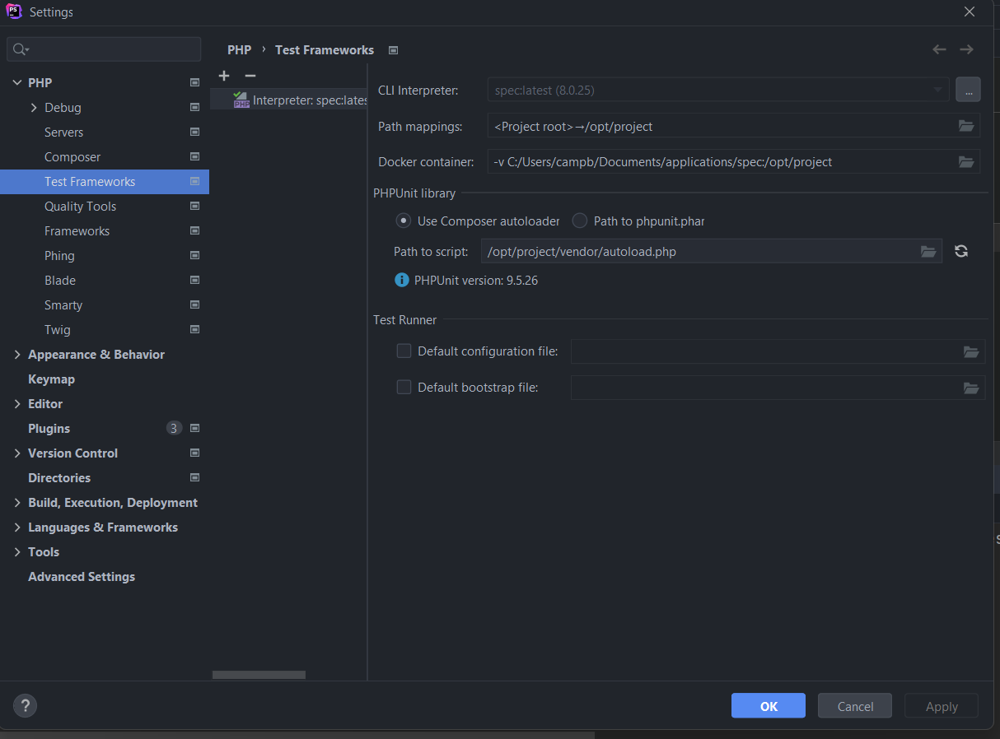

# Purpose

The purpose of this project is:

- demonstrate setup for docker CLI
- demonstrate setup for docker as test container
- tinker with concept from DDD book by Eric Evans

### Setup docker as interpreter

- Go to settings -> Php
- Click 3 dots next to CLI interpreter
- Click plus top left, then choose docker
- Then choose new server, select docker for windows
    - leave defaults alone
- Select image that was build/should be used and contains the project files
  
  

### Setup docker as test container

- Go to settings -> Php -> Test Frameworks
- Add new remote interpreter and close the server from the previous step
- Make sure project mappings and docker container mappings are correct
- Select "use composer autoloader"
- Set the "path to script" to the location of the autoloader file
  

Notes:

- Code will be included in test runs and normal code execution